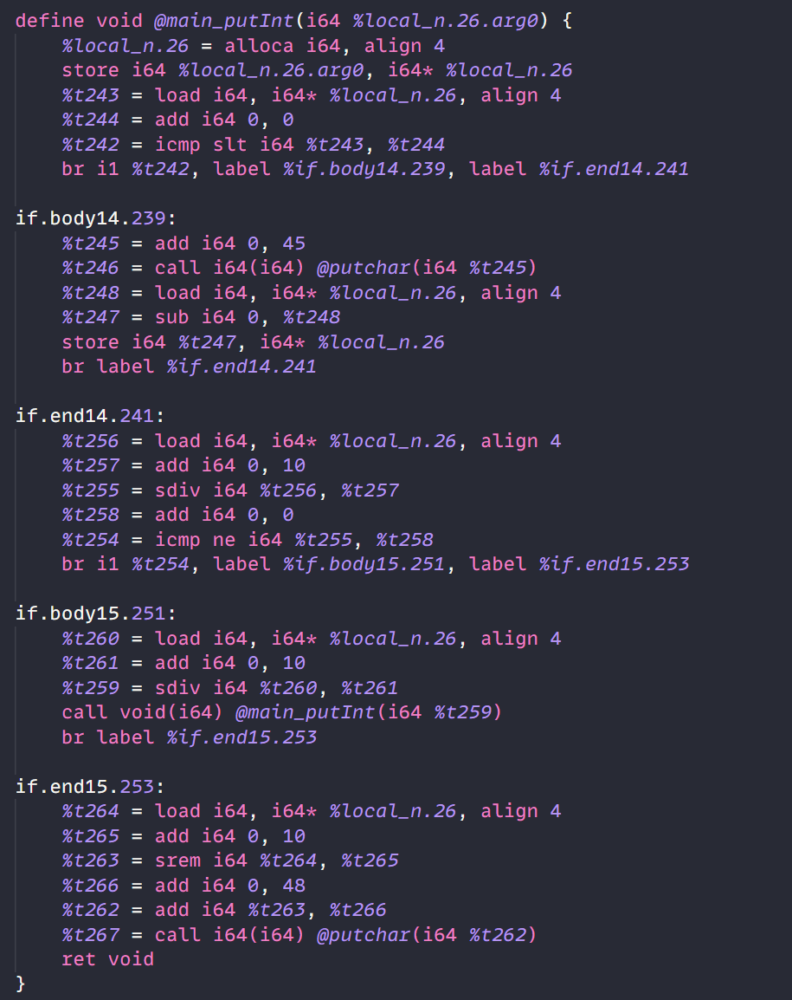

 <br></br>

<br></br>

<br></br>

<br></br>

<br></br>

<br></br>

<br></br>

<center><b><font size=6>浙江大学 实验报告</font></b></center>

<br></br>

<center><b><font size=4>编译原理</font></b></center>
<center><b><font size=4>Asc</font></b></center>

<br></br>

<center><b><font size=3.5>Date: 2023-06-18</font></b></center>
<div STYLE="page-break-after: always;"></div>

# 编译原理 实验报告

[MiniGo](https://github.com/Asilvorcarp/miniGo) - The compiler for **a subset of Golang**, implemented in C++ and Python.

Specific details of this subset can be found in the **Grammar** section below.

The project has been publicly released on [GitHub](https://github.com/asilvorcarp/miniGo).


## Usage

```bash
miniGo main.go -o main.ll
python src/Backend.py -f main.ll -o main.s
```

`main.go` is the Golang source code, `main.ll` is the LLVM IR and `main.s` is the AMD64 assembly code.

This will also generate the AST json file `ast.o.json` and interference graphs at `build/graph` for debugging.


## Build and Test

**To build the frontend `build/miniGo`:**

```bash
make # Or: make miniGo 
```

Backend at: `src/Backend.py`

**To test on every test case in `debug/tests/X.go` with input files `debug/tests/X/*.in`:**

```bash
make tests
```

To clean up:

```bash
make clean
```

More details are available in the `Makefile`.


## Grammar

Details about the subset of Golang.

### Types

int / multi-dimensional array.

### Keywords

```
"package"
"var"
"func"
"return"
"if"
"else"
"for"
"break"
"continue"
"defer"
"goto"
"const"
"nil"
```

### EBNF

For example, it has 3 kinds of `for` statement, just like Golang.

```c++
ForStmt : FOR Block                               // while(true)
	| FOR Exp Block                               // while
    | FOR SimpleStmt ';' Exp ';' SimpleStmt Block // typical for
    ;
```

The full EBNF:

```c++
Param : IDENT BType ;
ParamList : /* empty */  | Param  | ParamList ',' Param ;
FuncDef : FUNC IDENT '(' ParamList ')' ReturnType Block ;
ReturnType : /* empty */  | BType;
Block : '{}' ;
StmtList : /* empty */  | Stmt  | StmtList Stmt ;
ExpStmt : Exp ;
IncDecStmt : LVal INC  | LVal DEC ;
AssignStmt : LVals '=' InitVals  | LVal BIN_ASSIGN InitVal ;
// i, j := 0, 10
ShortVarDecl : LVals DEFINE InitVals ;
SimpleStmt : /* empty stmt */ 
           | ExpStmt
           | IncDecStmt 
           | AssignStmt 
           | ShortVarDecl 
           ;
IfStmt : IF Exp Block  | IF Exp Block ELSE Block  | IF Exp Block ELSE IfStmt  | IF SimpleStmt ';' Exp Block  | IF SimpleStmt ';' Exp Block ELSE Block  | IF SimpleStmt ';' Exp Block ELSE IfStmt ;
ReturnStmt : RETURN Exp  | RETURN ;
// BREAK, CONTINUE, GOTO
BranchStmt : BREAK  | CONTINUE  | GOTO IDENT ;
ForStmt : FOR Block  | FOR Exp Block  | FOR SimpleStmt ';' Exp ';' SimpleStmt Block { // for
};
Stmt : Decl | IfStmt | ReturnStmt | SimpleStmt | ForStmt | Block | BranchStmt ;

// array: var a [2]type
IDs : IDENT  | IDs ',' IDENT ;
// initVal can be exp, array exp, make exp
InitVal : BType '{}'  | MAKE '(' BType ',' Exp ')'  | Exp;
InitVals : InitVal  | InitVals ',' InitVal ;
InitValList : /* empty */  | InitVals;
ConstInitVal  : ConstExp ;
ConstInitVals : ConstInitVal  | ConstInitVals ',' ConstInitVal ;

VarDecl : VAR VarSpec ;
VarSpec : IDs BType '=' InitVals | IDs '=' InitVals | IDs BType ;
ConstDecl : CONST ConstSpec ;
ConstSpec : IDs BType '=' ConstInitVals | IDs '=' ConstInitVals ;

Decl : VarDecl | ConstDecl;
ConstIndex : '[' ConstExp ']' | '[' ']' ;
ConstIndexList :  | ConstIndexList ConstIndex ;
BType : ConstIndexList INT ;

Number : INT_CONST | CHAR_CONST ;
Exp : LOrExp;
LVal : IDENT  | LVal '[' Exp ']' ;
LVals : LVal  | LVals ',' LVal ;
PrimaryExp : '(' Exp ')'  | LVal | Number  | NIL ;
UnaryExp : PrimaryExp | IDENT '(' ArgList ')'  | UnaryOp UnaryExp ;
UnaryOp: '+' | '-' | '!';
ArgList : /* empty */  | Exp  | ArgList ',' Exp ;
MulExp: UnaryExp | MulExp MulOp UnaryExp ;
MulOp: '*' | '/' | '%';
AddExp: MulExp | AddExp AddOp MulExp ;
AddOp: '+' | '-';
RelExp: AddExp | RelExp RelOp AddExp ;
RelOp: '<' | '>' 
     | LE | GE;
EqExp: RelExp | EqExp EqOp RelExp ;
EqOp: EQ | NE;
LAndExp: EqExp | LAndExp AND EqExp ;
LOrExp: LAndExp | LOrExp OR LAndExp ;
ConstExp: Exp ;
```


## Modules

Main Process:

​	`Golang Code -> Tokens -> AST -> LLVM IR -> Machine Code`

Each arrow is completed by each of the following 4 modules:

`Scanner, Parser, Compiler, Backend.`

### Scanner

使用Flex工具完成，代码位于`miniGo.l`.

作用：用于将Golang源代码转化为Token流，忽略掉了注释以及空白字符等。

特性：包括了对字符字面量、八进制和十六进制字面量的支持。


### Parser

使用Yacc工具完成，相关代码包括`miniGo.y`和`AST.hpp`.

作用：由Token流构建AST。

特性：

1. 通过转换为Equivalent AST的方式来支持一些语法糖，例如`a+=1 -> a=a+1`，详见Equivalent AST章节。
2. 支持以Json格式输出AST。

使用方法：

```c++
unique_ptr<BaseAST> ast;
auto ret = yyparse(ast);
assert(!ret);
// To get a json of AST
FILE *astFp = fopen("ast.o.json", "w");
fprintf(astFp, "%s", ast->toJson().dump(4).c_str());
fclose(astFp);
```

生成的Json类似下图：


#### AST

各种AST的继承关系如下：


其中 `BaseAST` 是所有AST的父类，他具有下面这些方法：


其中需要说明的主要有：

 `getParent()` 主要用于实现 `break; continue;` 等语句，通过找到最近的父节点`ForStmtAST`从而得出跳转位置。

`copy()` 主要用于实现一些等价的语法转换，例如从 `a+=1` 转换到 `a=a+1` 的时候，需要复制出一个新的代表 `a` 的AST。

### Compiler

相关代码包括 `Compiler.hpp`, `AST.hpp` and `Scope.hpp`.

作用：由AST生成对应的LLVM IR。

特性：

1. 类型推导，详见下面的Type inference章节。
2. 类型检查，详见下面的Type checking章节。
3. 语法报错。

使用方法：

```c++
    auto compiler = Compiler();
#ifdef YYDEBUG
    compiler.debug = true;
#endif
    auto unit = reinterpret_cast<CompUnitAST *>(ast.get());
    string ll = compiler.Compile(unit);
    // write to file
    FILE *fp = fopen("main.ll", "w");
    fprintf(fp, "%s", ll.c_str());
    fclose(fp);
```

相关方法与说明：


### Backend

相关代码包括 `Backend.py`.

作用：由LLVM IR生成对应的AMD64机器码。

特性：

1. 每个函数单独处理，推导变量活性，生成冲突图。
：只使用R8-R15作为临时变量(足够)

2. 传参使用RDI、RSI、RDX、RCX，其余通过压栈传入。

3. 部分简单优化。

使用方法：

```bash
python src/Backend.py -f main.ll -o main.s
```

同时默认会在 `build/graph/` 目录下生成各个函数的冲突图，例如：


## Features

### Array

Dynamic array is implemented with runtime function `malloc`.
The compiler knows the dimension of the array
through methods like `Compiler::inferType(pAST exp)` and `BaseAST::info()`.

You can construct a array with function `make(Type t, int size)` in Golang.

For example:

```go
arr := make([][]int, 4)
arr[0] = make([]int, 5)
arr[1] = make([]int, 5)
arr[1][1] = 110
putint(arr[1][1])
```

Local array is implemented with `alloca` in LLVM IR, which is freed when the function returns.
The template of alloca: `pT1 = alloca T1, i32 numOfElements, align 4`.

### Runtime functions

The functions including `getchar` `putchar` and `malloc` are specified in the scope of the language, see `src/Scope.hpp`.
They act like the standard library or the runtime of Golang, and would be linked with the generated LLVM IR.

### Type inference

Type inference is needed because of statements like `i := arr[1]`.
Some simple type inference is done by `Compiler::inferType(pAST exp)` and `BaseAST::info()`. 

The former is used to infer the type of a expression,
usually for the right hand side of a assignment.

The latter is often used to get the type of some part of a statement,
so that the compiler can generate the correct LLVM IR.
This includes the type of a variable in a declaration,
the type of a function parameter in a function definition,
the type of the expression in a return statement, etc.

For example:

Type mismatch error of the two operator of a binary expression will be thrown.

And type of expressions like `array[1][2]` will be infered by reducing the dimension of the array's type.


### Type checking

Some simple type checking is done inside of some methods of the compiler, including:

1. When indexing an array, the index expression should be of type `int`.
   If not, the compiler would throw an exception, like
   `compileExpr: index expression is not int`.

2. When `compileExpr` compiles a expression of type `CallExpAST` (function call),
   it would check if the number of arguments matches the number of parameters,
   and if the type of each argument matches the type of the corresponding parameter.
   If not, the compiler would throw an exception, like
   `compileExpr: type mismatch in function call - FuncName`
   ` - arg "a" has type "int", but expected "[]int"`.

3. When `compileStmt` compiles a statement of type `ReturnStmtAST`,
   it would check if the type of the expression matches the return type of the function.
   Techniques like finding the func containing the return statement are needed.

Relavant functions in class `Compiler`:

- `bool matchType(string t1, string t2)`: check if two types match.
- `bool isPtr(string t)`: check if a type is a pointer.
- `string reduceDim(string t)`: reduce the dimension of a type by 1.
- `string reduceDim(string t, int n)`: reduce the dimension of a type by n.
- `string increaseDim(string t)`: increase the dimension of a type by 1.
- `string inferType(pAST exp)`: infer the type of a expression.

For example:

This checks the types of arguments and the types of the function parameters.


### Const expression

Const expression is evaluated at compile time with `int ExpAST::eval()`.
The compiler would throw an exception if the expression is not const.

### Equivalent AST

Some candy grammars are implemented by converting to an equivalent AST, including:

```c++
a += b 
-> a = a + b

a++
-> a = a + 1

a := b
-> var a = b

a := []int{1, 2, 3}
-> var a = make([]int, 3)
   a[0] = 1
   a[1] = 2
   a[2] = 3
```

So that it won't need to consider those candy grammars later.


### Some small features

#### Multi-assignment in Golang

Multi-assignment is supported, like `a, b = c, d`.

Moreover, because temp variables are generated for each right hand side expression,
we can do cool stuff like **swapping by `a, b = b, a`**.

#### char literal, like `'a'`

#### assign with binary operators, like `a += 1`


### Simple Optimizations

Some simple optimizations were performed in the backend.

For example:

1. If both operator is immediate number, the backend will calculate the result and move it to the destination register directly.

   ```python
   if op == "add":
       rs1 = toR(regs[0])
       rs2 = toR(regs[1])
       rd = toR(i)
       # do not overwrite rs2
       if rd == rs2:
           rs1, rs2 = rs2, rs1
           cmds += [f"movq {rs1}, {rd}"]
           cmds += [f"addq {rs2}, {rd}"]
           if optimize: # <------- HERE----------
               isI = isImm(rs1, rs2)
               # both are imm
               if None not in isI:
                   res = isI[0] + isI[1]
                   cmds = [f"movq ${res}, {rd}"]
   ```

2. All useless `mov` will be removed, and the the latter of two adjacent `br` will be removed.
3. ...

After implementing these optimizations, the assembly code has been reduced by approximately 5% according to certain tests.


## 运行结果示例以及截图

An example of `putInt`:

Golang Code:

```go
// fmt.Printf("%d", n)
func putInt(n int) {
	if n < 0 {
		putchar('-')
		n = -n
	}
	if n/10 != 0 {
		putInt(n / 10)
	}
	putchar(n%10 + '0')
}
```

LLVM:



AMD64 assembly:

Here two register (r8, r9) are needed for temporary storage according to the liveness analysis and thus are protected.


Three tests from TA:


## Git log

**详见：**[Commits · Asilvorcarp/miniGo (github.com)](https://github.com/Asilvorcarp/miniGo/commits/main)


